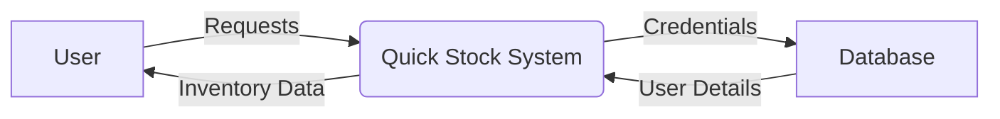
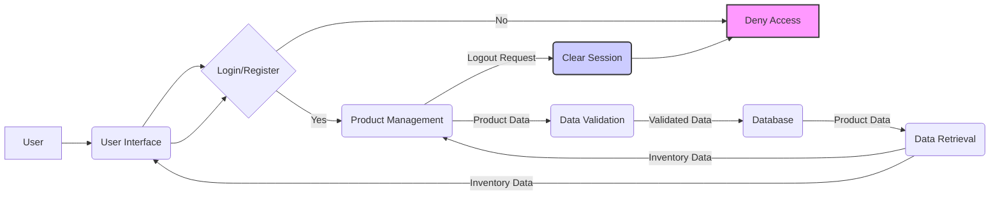

```mermaid

graph LR
    A[User] -->|Requests| B(Quick Stock System)
    B -->|Inventory Data| A
    B -->|Credentials| C[Database]
    C -->|User Details| B
```

```mermaid
graph LR
    A[User] --> B(User Interface);
    B --> C{Login/Register};
    C -- Yes --> D(Product Management);
    C -- No --> E[Deny Access];
    D -->|Product Data| F(Data Validation);
    F -->|Validated Data| G(Database);
    G -->|Product Data| H(Data Retrieval);
    H -->|Inventory Data| D;
    H -->|Inventory Data| B;
    D -->|Logout Request| J(Clear Session)
    J --> E
    B --> C;
    style E fill:#f9f,stroke:#333,stroke-width:2px
    style J fill:#ccf,stroke:#333,stroke-width:2px

```
