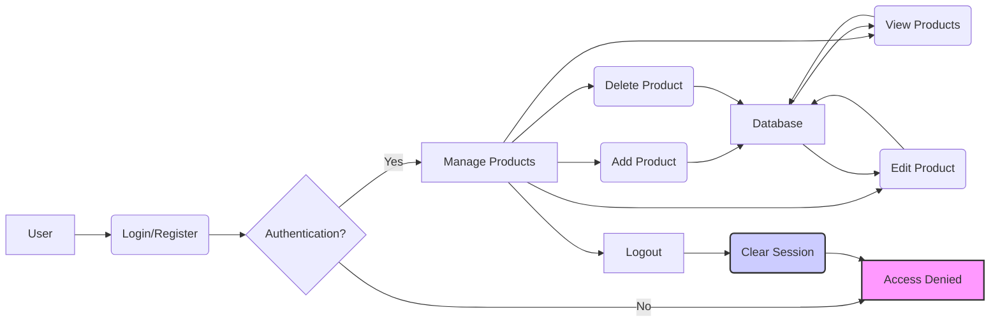

```mermaid
graph LR
    A[User] --> B(Login/Register);
    B --> C{Authentication?};
    C -- Yes --> D[Manage Products];
    C -- No --> E[Access Denied];
    D --> F(Add Product);
    D --> G(View Products);
    D --> H(Edit Product);
    D --> I(Delete Product);
    D --> J[Logout];
    F --> K[Database];
    G --> K;
    H --> K;
    I --> K;
    J --> L(Clear Session);
     L--> E
    K --> G;
    K --> H;
   style E fill:#f9f,stroke:#333,stroke-width:2px
    style L fill:#ccf,stroke:#333,stroke-width:2px
```
